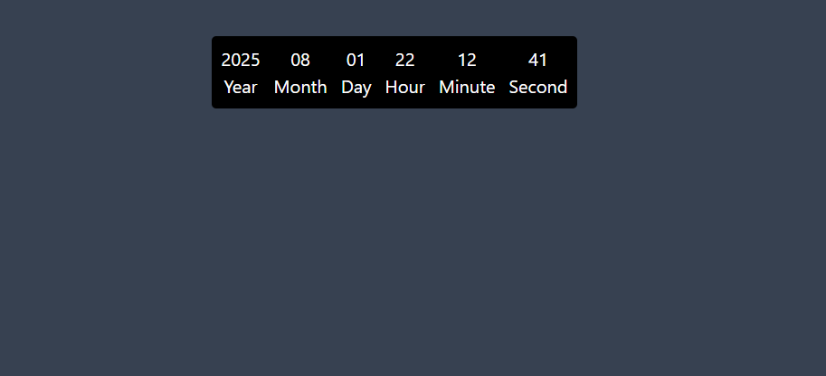

# ⏰ Live Current Time Display

A beautifully styled, fully responsive web app that shows the **current Year, Month, Day, Hour, Minute, and Second** — updated in real time using `setInterval()` and the native JavaScript `Date()` object.

Built with **HTML**, **Tailwind CSS**, and **Vanilla JavaScript**, this project is perfect for beginners and frontend developers looking to master dynamic DOM manipulation with clean, utility-first styling.

  

---

## 🚀 Live Demo

🔗 **Coming Soon** — Deploying to GitHub Pages...

---

## ✨ Features

- ✅ Live time updates (per second)
- 🎨 Sleek dark mode using Tailwind utility classes
- 🧠 Clean DOM logic with ES6 syntax
- ⚡ Instant styling via Tailwind CDN

---

## 🛠️ Technologies Used

| 🔧 Technology         | 💡 Description                                               |
|----------------------|--------------------------------------------------------------|
|  | Markup for structuring the page content            |
|  | Utility-first CSS framework loaded via CDN         |
|  | Fetching and updating the live time every second   |
|  | No build tools — works instantly in browser        |

---

## 📁 Project Structure

├── 📄 current.html   → Main HTML file with structure and styling via Tailwind |
└── 📄 current.js     → JavaScript file responsible for real-time clock updates
